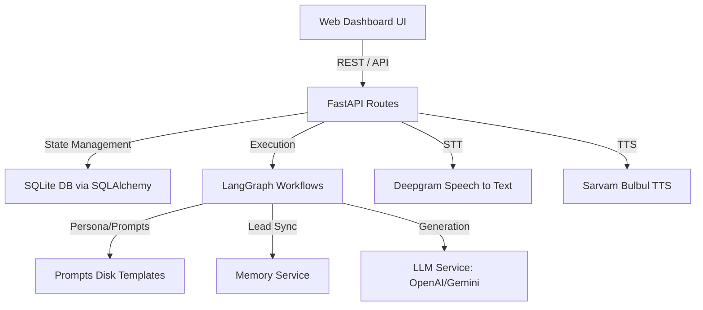

# Architecture Design - Real Estate Voice Agent

This document outlines the layered architecture of the Shubh Residency Outbound AI Voice Agent system.

## Structural Design

### 1. Presentation Layer (Frontend)
A responsive glassmorphic web dashboard built using HTML5, CSS3, and modern vanilla JavaScript. It manages live audio capture via standard browser media APIs, handles text fallback interactions, and displays lead status cards.

### 2. API / Controller Layer (FastAPI)
Acts as the central web controller. Declares endpoints for lead creation, call setup, turn-by-turn chat processing, booking overrides, and summary retrievals. It manages the connection of audio payloads to the Speech services.

### 3. Workflow Engine (LangGraph)
Uses `langgraph.graph.StateGraph` to control conversation flow. The agent transitions between nodes (Greeting, Qualification, Knowledge Retrieval, Objections, Booking, Summary, etc.) based on user inputs.

### 4. Database Layer (SQLAlchemy / SQLite)
Persists Lead records, booking details, call sessions, and generated summaries. Ensures that state details can be stored and restored seamlessly between dialogue turns.

### 5. AI I/O Services
- **LLM Service**: Connects to Gemini or OpenAI, falling back to a rule-based mock engine if keys are absent.
- **STT (Deepgram)**: Transcribes incoming audio blobs.
- **TTS (Sarvam Bulbul)**: Synthesizes output responses into natural sounding Gujarati or Hindi voices.
