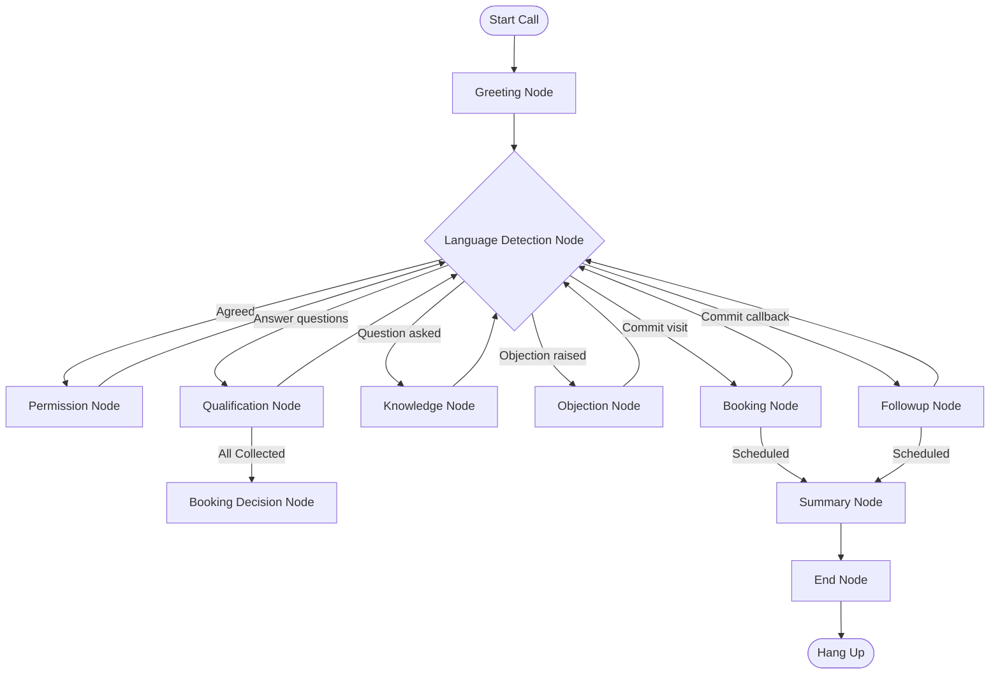

# Conversational Agent Workflows

This document describes the state transitions and workflow routing logic implemented in our LangGraph StateGraph engine.

## State Transitions Map

## Node Behaviors

1. **Greeting Node**: Welcomes the customer in Code-Mixed Gujarati and introduces the executive persona, Sarah.
2. **Language Detection Node**: Determines the customer's language preference (Gujarati, Hindi, or English) to adjust downstream response generations.
3. **Permission Node**: Asks the buyer's permission to ask qualification questions.
4. **Qualification Node**: Evaluates which buyer requirement fields (Budget, Location, BHK Type, Purpose, Timeline) are missing and queries the user for them one-at-a-time.
5. **Knowledge Node**: Intercepts project questions (pricing, location, possession dates) and answers them using locally loaded JSON knowledge files.
6. **Objection Node**: Empathizes with and resolves complaints (e.g. high budget, family discussions) using local real estate objection-handling guidelines.
7. **Booking Decision Node**: Queries whether they are ready to schedule a tour.
8. **Booking Node**: Confirms and records visit date/time.
9. **Follow-up Node**: Records a convenient call-back window if the customer is too busy or not ready to visit.
10. **Summary Node**: Compiles a structured JSON profile detailing the final status, objections raised, and buyer interest score.
